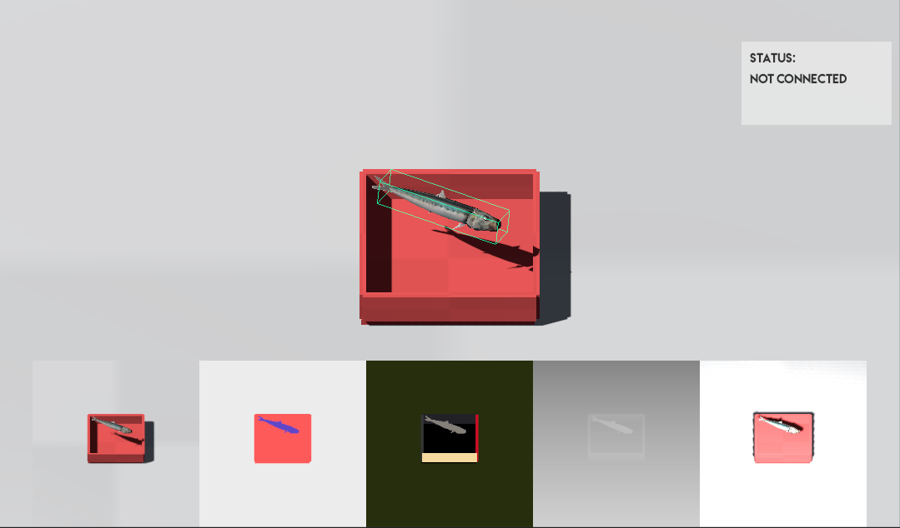
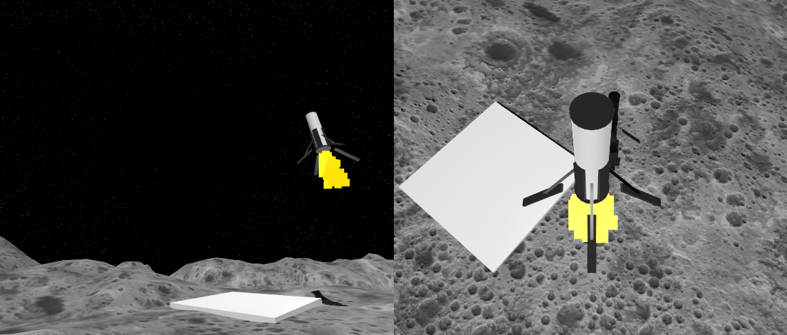
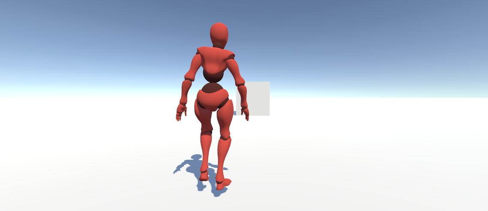
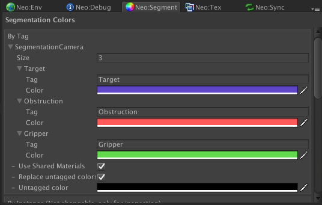
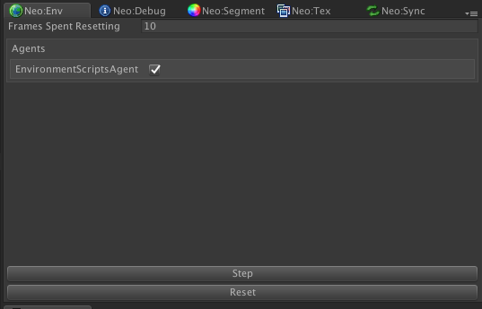

# Droid
Droid is a unity package that enables prototyping reinforcement learning environments and communication to the [Neo](https://github.com/sintefneodroid/neo) counterpart of the [Neodroid](https://github.com/sintefneodroid) platform.

This project is very similar to Unity's own project [Unity Machine Learning Agents](https://github.com/Unity-Technologies/ml-agents). The alot of the efforts done in this project was made prior to their announcement, [Introducing: Unity Machine Learning Agents](https://blogs.unity3d.com/2017/09/19/introducing-unity-machine-learning-agents/). The entire Neodroid platform served and still serves as a tool for academic research specific to the authors interests, hence explaining to the existence and future direction of this project.

## Screenshot Of The Game View With The Droid Unity Package


## Setup

Download the newest Droid.unitypackage from [releases](https://github.com/sintefneodroid/droid/releases) and import into your Unity project.

## Environments
- GridWorld
- Puzzler
- Satellite
- LunarLander
- 3DGridWorld
- Walker
- And many more..





## Features
This unity packages is a selection of scripts and tools for easily setting up (Rapid prototyping) and experimenting reinforcement learning environments.

### Objective Functions (Out Of The Box, Easily Extendable)
- euclidean distance between objects

### Types Of Observations (Out Of The Box, Easily Extendable)
- positions
- rotations
- rigidbody velocities and angulars + differential versions
- bounding boxes of objects
- instance segmentation images
- segmentation images
- depth images
- infrared shadow images
- rgb images

### Types Of Motors (Out Of The Box, Easily Extendable)

- Rigidbody motors
- Transform motors
- Rocket motors
- Wheel torque and steering motors for vehicles

### Many Custom Windows For Quick Prototyping






## Development

### !Important Notice for Windows Users!
Run ```fix_windows_symlink.bat``` with administrative privileges, to make windows recognise the neodroid symlink in the unity  project of this repository. If on any other platform you should be fine.

# To Do's
- [ ] Server side memory hash table for large environment state spaces (raw poses and bodies are never send to the learning agent but instead a hash value is send, for dictionary look ups on the server).
- [ ] Be able to select and/or parameterise an objective/evaluation (None,ReachGoal,Stabilise,..) function for an environment

# Other Components Of The Neodroid Platform

- [agent](https://github.com/sintefneodroid/agent)
- [simulation](https://github.com/sintefneodroid/simulation)
- [neo](https://github.com/sintefneodroid/neo)
